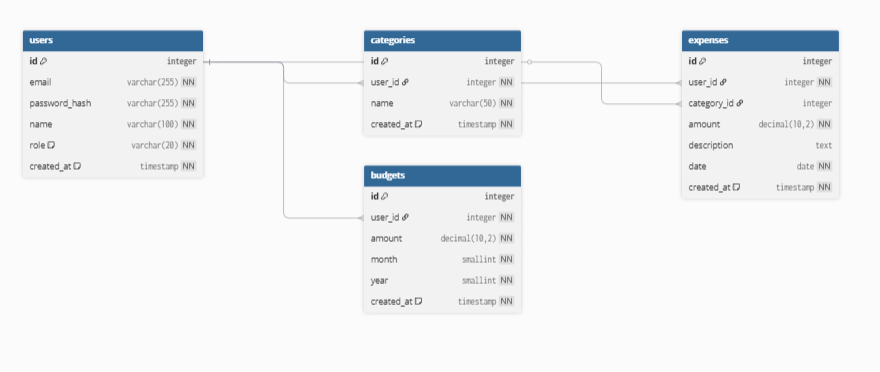

# База даних Expense Tracker

## 1. Опис таблиць

### users
Зберігає інформацію про зареєстрованих користувачів системи.
Основні поля: id, email (унікальний), password_hash, name, role, created_at.

### categories
Категорії витрат, що створюються користувачами (їжа, транспорт, розваги тощо).
Основні поля: id, user_id (FK → users), name, created_at.

### expenses
Основна таблиця — записи про витрати користувачів.
Основні поля: id, user_id (FK → users), category_id (FK → categories),
amount, description, date, created_at.

### budgets
Місячні ліміти витрат, які встановлює користувач.
Основні поля: id, user_id (FK → users), amount, month, year, created_at.

---

## 2. Зв'язки між таблицями

| Таблиця A | Таблиця B | Тип зв'язку | FK-поле |
|-----------|-----------|-------------|---------|
| users | expenses | 1:N (один user, багато expenses) | expenses.user_id |
| users | categories | 1:N (один user, багато categories) | categories.user_id |
| users | budgets | 1:N (один user, багато budgets) | budgets.user_id |
| categories | expenses | 1:N (одна category, багато expenses) | expenses.category_id |

---

## 3. ER-діаграма



Діаграму побудовано у сервісі dbdiagram.io.

---

## 4. Аналіз нормалізації

### 1NF (Перша нормальна форма) ✅
Всі поля містять атомарні значення. Немає полів зі списками.
Наприклад, категорії НЕ зберігаються як рядок "їжа,транспорт" у таблиці expenses —
для них є окрема таблиця categories.

### 2NF (Друга нормальна форма) ✅
Всі таблиці мають простий первинний ключ (id), тому проблем з частковою
залежністю від складеного ключа немає. Кожен атрибут залежить від усього PK.

### 3NF (Третя нормальна форма) ✅
Немає транзитивних залежностей. Наприклад, назва категорії зберігається
в таблиці categories, а не дублюється в кожному рядку expenses.
Якщо змінити назву категорії — змінюємо в одному місці.

---

## 5. Як застосувати схему

```bash
# Створити базу даних і застосувати схему через SQLite
sqlite3 expense_tracker.db < docs/database/schema.sql

# Або через Node.js (better-sqlite3):
node -e "require('better-sqlite3')('expense_tracker.db')"
```
