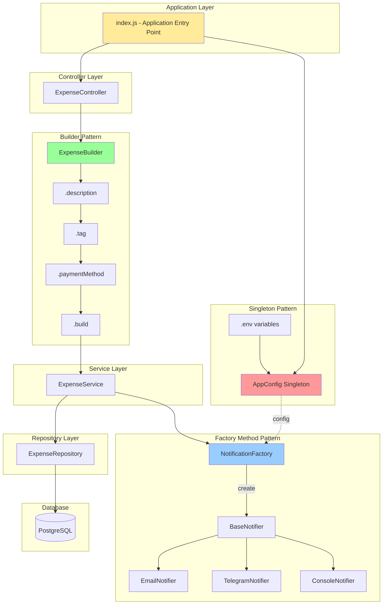
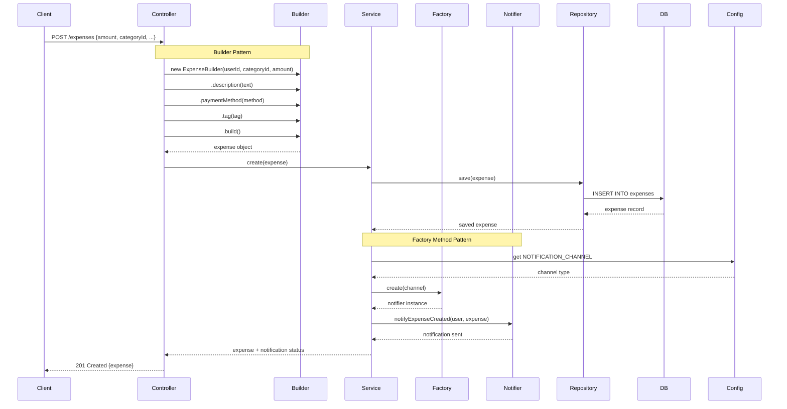
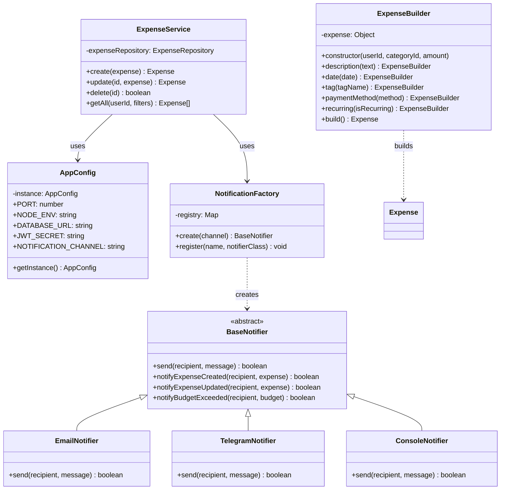

# Архітектурна діаграма породжуючих патернів

## Загальна структура системи



## Потік створення витрати з патернами



## Діаграма класів



## Патерни та принципи SOLID

### Singleton - AppConfig
**Принципи:**
- **Single Responsibility**: Управління конфігурацією
- **Open/Closed**: Закритий для модифікації, відкритий для розширення через змінні середовища

**Переваги:**
- Єдина точка доступу
- Контрольоване створення екземпляра
- Глобальний доступ без глобальних змінних

### Factory Method - NotificationFactory
**Принципи:**
- **Open/Closed**: Нові нотифікатори через register()
- **Dependency Inversion**: Залежність від абстракції BaseNotifier
- **Liskov Substitution**: Всі нотифікатори взаємозамінні

**Переваги:**
- Інкапсуляція логіки створення
- Легке тестування через мокування
- Розширюваність без зміни коду

### Builder - ExpenseBuilder
**Принципи:**
- **Single Responsibility**: Тільки створення об'єктів
- **Interface Segregation**: Fluent interface для зручності

**Переваги:**
- Читабельний код
- Валідація на кожному кроці
- Гнучкість у порядку параметрів

## Сценарії використання

### Сценарій 1: Створення витрати з нотифікацією
```javascript
// 1. Отримати конфігурацію (Singleton)
const config = require('./core/config');

// 2. Створити витрату (Builder)
const expense = new ExpenseBuilder(userId, categoryId, 150.50)
  .description('Покупка продуктів')
  .paymentMethod('card')
  .tag('groceries')
  .build();

// 3. Зберегти та відправити нотифікацію (Factory)
const saved = await expenseService.create(expense);
// Всередині create():
//   - Зберігає в БД
//   - Створює нотифікатор через Factory
//   - Відправляє повідомлення
```

### Сценарій 2: Додавання нового каналу нотифікацій
```javascript
// Створити новий нотифікатор
class SlackNotifier extends BaseNotifier {
  send(recipient, message) {
    // Slack API integration
    console.log(`[SLACK] ${recipient}: ${message}`);
    return true;
  }
}

// Зареєструвати без зміни фабрики (OCP)
NotificationFactory.register('slack', SlackNotifier);

// Використовувати
const notifier = NotificationFactory.create('slack');
notifier.send('#expenses', 'Нова витрата створена');
```

### Сценарій 3: Різні конфігурації для різних середовищ
```javascript
// Development
NOTIFICATION_CHANNEL=console npm run dev

// Production
NOTIFICATION_CHANNEL=email npm start

// Testing
NOTIFICATION_CHANNEL=console npm test
```

## Тестування патернів

### Unit тести
```javascript
// Singleton
test('AppConfig returns same instance', () => {
  const config1 = require('./core/config');
  const config2 = require('./core/config');
  expect(config1).toBe(config2);
});

// Factory
test('Factory creates correct notifier', () => {
  const notifier = NotificationFactory.create('email');
  expect(notifier).toBeInstanceOf(EmailNotifier);
});

// Builder
test('Builder creates valid expense', () => {
  const expense = new ExpenseBuilder(1, 5, 100)
    .description('Test')
    .build();
  expect(expense.amount).toBe(100);
  expect(expense.description).toBe('Test');
});
```

### Integration тести
```javascript
test('ExpenseService sends notification on create', async () => {
  const mockNotifier = jest.fn();
  NotificationFactory.register('mock', mockNotifier);
  
  const expense = await expenseService.create({...});
  
  expect(mockNotifier).toHaveBeenCalled();
});
```

## Метрики успіху

- ✅ Код відповідає принципам SOLID
- ✅ Покриття тестами > 80%
- ✅ Всі патерни інтегровані в проект
- ✅ Демо-скрипт працює без помилок
- ✅ Документація оновлена
- ✅ Pull Request створений та змержений

---

**Дата створення:** 2026-05-07  
**Автор:** Sidelnykov  
**Проект:** kpz-expensetracker
