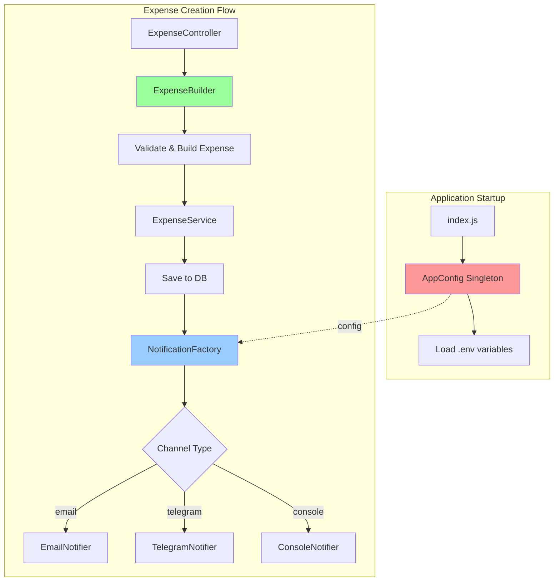

# План реалізації породжуючих патернів для Expense Tracker

## Огляд завдання

Реалізувати три породжуючих патерни проектування у проекті Expense Tracker:
1. **Singleton** - для конфігурації застосунку
2. **Factory Method** - для системи нотифікацій
3. **Builder** - для створення складних об'єктів витрат

## Архітектурний контекст

**Поточна структура проекту:**
- Node.js + Express.js
- PostgreSQL + Prisma ORM
- JWT автентифікація
- Існуючі сервіси: [`ExpenseService`](../src/refactored/expenseService.js), [`UserService`](../src/refactored/user_manager.js)

## Детальний план реалізації

### Крок 1: Підготовка репозиторію

**Дії:**
```bash
git switch main
git pull origin main
git switch -c feature/design-patterns-creational
```

**Мета:** Створити ізольовану гілку для нових змін згідно з Git Flow практиками.

---

### Крок 2: Singleton - Конфігурація застосунку

**Файл:** `src/core/config.js`

**Призначення:** 
Централізоване управління конфігурацією застосунку. Singleton гарантує, що конфігурація завантажується один раз і використовується всюди в проекті.

**Функціональність:**
- Завантаження змінних з `.env` файлу
- Валідація обов'язкових параметрів
- Єдиний екземпляр на весь застосунок
- Thread-safe реалізація (додаткове завдання)

**Параметри конфігурації:**
```javascript
{
  PORT: 3000,
  NODE_ENV: 'development',
  DATABASE_URL: 'postgresql://...',
  JWT_SECRET: 'secret',
  JWT_EXPIRES_IN: '7d',
  LOG_LEVEL: 'INFO',
  NOTIFICATION_CHANNEL: 'console' // email, telegram, console
}
```

**Переваги для проекту:**
- Уникнення повторного читання `.env` файлу
- Централізований доступ до налаштувань
- Легке тестування через мокування

---

### Крок 3: Factory Method - Система нотифікацій

**Файл:** `src/services/notificationFactory.js`

**Призначення:**
Створення різних типів нотифікаторів залежно від конфігурації або контексту. Дозволяє легко додавати нові канали комунікації без зміни існуючого коду.

**Структура класів:**

```
BaseNotifier (abstract)
├── EmailNotifier
├── TelegramNotifier
└── ConsoleNotifier
```

**Сценарії використання в Expense Tracker:**
1. **Створення витрати** - повідомлення користувачу про успішне додавання
2. **Перевищення бюджету** - попередження про досягнення ліміту
3. **Щоденний звіт** - підсумок витрат за день
4. **Нагадування** - про заплановані платежі

**Приклад використання:**
```javascript
const notifier = NotificationFactory.create('email');
notifier.notifyExpenseCreated(user.email, expense);
```

**Розширюваність:**
- Метод [`register()`](../src/services/notificationFactory.js) для додавання нових каналів
- Можливість додати: Slack, SMS, Push, Webhook

---

### Крок 4: Builder - Конструктор об'єктів витрат

**Файл:** `src/models/expenseBuilder.js`

**Призначення:**
Спрощення створення складних об'єктів витрат з валідацією та значеннями за замовчуванням.

**Проблема, яку вирішує:**
Поточний [`ExpenseService.create()`](../src/refactored/expenseService.js:95) приймає багато параметрів. Builder робить код більш читабельним та гнучким.

**Параметри витрати:**
```javascript
{
  userId: number,           // обов'язковий
  categoryId: number,       // обов'язковий
  amount: number,           // обов'язковий, валідація 0.01-1000000
  description: string,      // опціональний
  date: Date,              // за замовчуванням - сьогодні
  tags: string[],          // опціональний
  paymentMethod: string,   // cash, card, crypto
  isRecurring: boolean,    // для повторюваних витрат
  attachments: string[]    // посилання на файли
}
```

**Приклад використання:**
```javascript
const expense = new ExpenseBuilder(userId, categoryId, 150.50)
  .description('Покупка продуктів у супермаркеті')
  .paymentMethod('card')
  .tag('groceries')
  .tag('food')
  .date(new Date())
  .build();
```

**Валідація:**
- Сума: 0.01 ≤ amount ≤ 1,000,000
- Дата: не може бути в майбутньому
- PaymentMethod: тільки дозволені значення
- CategoryId: перевірка існування

---

### Крок 5: Тестування Singleton

**Файл:** `tests/core/config.test.js`

**Тест-кейси:**
1. ✓ Два виклики повертають той самий екземпляр
2. ✓ Конфігурація завантажується тільки один раз
3. ✓ Всі обов'язкові параметри присутні
4. ✓ Значення за замовчуванням працюють коректно
5. ✓ Thread-safety (паралельні виклики)

---

### Крок 6: Демонстраційний скрипт

**Файл:** `demo/patterns-demo.js`

**Структура:**
```javascript
// 1. Демонстрація Singleton
console.log('=== SINGLETON: AppConfig ===');
// Показати, що cfg1 === cfg2

// 2. Демонстрація Factory Method
console.log('=== FACTORY METHOD: NotificationFactory ===');
// Створити різні нотифікатори та відправити тестові повідомлення

// 3. Демонстрація Builder
console.log('=== BUILDER: ExpenseBuilder ===');
// Створити витрату з різними параметрами
```

**Запуск:**
```bash
node demo/patterns-demo.js
```

---

### Крок 7: Додаткові завдання

#### Завдання A: Thread-safe Singleton

**Проблема:** 
У багатопотоковому середовищі два потоки можуть одночасно створити два екземпляри.

**Рішення для JavaScript:**
JavaScript є однопотоковим, але async операції можуть створити race condition.

**Реалізація:**
```javascript
class AppConfig {
  static #instance = null;
  static #isInitializing = false;
  static #initPromise = null;

  static async getInstance() {
    if (this.#instance) return this.#instance;
    
    if (this.#isInitializing) {
      return this.#initPromise;
    }
    
    this.#isInitializing = true;
    this.#initPromise = this.#initialize();
    this.#instance = await this.#initPromise;
    this.#isInitializing = false;
    
    return this.#instance;
  }
}
```

#### Завдання B: Розширення Factory через register()

**Мета:** Додати новий тип нотифікатора без зміни коду фабрики.

**Приклад:**
```javascript
// Новий нотифікатор
class SlackNotifier extends BaseNotifier {
  send(recipient, message) {
    // Slack API integration
  }
}

// Реєстрація без зміни NotificationFactory
NotificationFactory.register('slack', SlackNotifier);

// Використання
const notifier = NotificationFactory.create('slack');
```

**Принцип:** Open/Closed Principle (OCP) - відкритий для розширення, закритий для модифікації.

---

## Структура файлів після реалізації

```
kpz-expensetracker-Sidelnykov/
├── src/
│   ├── core/
│   │   └── config.js                    # Singleton
│   ├── services/
│   │   └── notificationFactory.js       # Factory Method
│   ├── models/
│   │   └── expenseBuilder.js            # Builder
│   └── ...
├── tests/
│   ├── core/
│   │   └── config.test.js               # Тести Singleton
│   ├── services/
│   │   └── notificationFactory.test.js  # Тести Factory
│   └── models/
│       └── expenseBuilder.test.js       # Тести Builder
├── demo/
│   └── patterns-demo.js                 # Демонстрація
└── plans/
    └── design-patterns-plan.md          # Цей документ
```

---

## Інтеграція з існуючим кодом

### 1. Використання AppConfig

**До:**
```javascript
const port = process.env.PORT || 3000;
const dbUrl = process.env.DATABASE_URL;
```

**Після:**
```javascript
const config = require('./core/config');
const port = config.PORT;
const dbUrl = config.DATABASE_URL;
```

### 2. Використання NotificationFactory

**Інтеграція в ExpenseService:**
```javascript
class ExpenseService {
  async create(userId, categoryId, amount, description, date) {
    const expense = await this.expenseRepository.save(...);
    
    // Відправити нотифікацію
    const notifier = NotificationFactory.create(config.NOTIFICATION_CHANNEL);
    await notifier.notifyExpenseCreated(user.email, expense);
    
    return expense;
  }
}
```

### 3. Використання ExpenseBuilder

**Інтеграція в контролер:**
```javascript
async createExpense(req, res) {
  const { categoryId, amount, description, paymentMethod, tags } = req.body;
  
  const expense = new ExpenseBuilder(req.user.id, categoryId, amount)
    .description(description)
    .paymentMethod(paymentMethod)
    .tags(tags)
    .build();
    
  const saved = await expenseService.save(expense);
  res.json(saved);
}
```

---

## Діаграма взаємодії патернів



---

## Переваги реалізації

### Singleton (AppConfig)
✅ Єдина точка доступу до конфігурації  
✅ Завантаження один раз при старті  
✅ Легке тестування через мокування  
✅ Валідація налаштувань при ініціалізації  

### Factory Method (NotificationFactory)
✅ Легке додавання нових каналів  
✅ Відповідність принципу OCP  
✅ Централізована логіка створення  
✅ Можливість A/B тестування каналів  

### Builder (ExpenseBuilder)
✅ Читабельний код створення об'єктів  
✅ Валідація на кожному кроці  
✅ Гнучкість у порядку встановлення параметрів  
✅ Значення за замовчуванням  

---

## Критерії прийняття

- [ ] Всі три патерни реалізовані та працюють
- [ ] Написані unit-тести з покриттям >80%
- [ ] Демо-скрипт успішно виконується
- [ ] Код відповідає ESLint правилам проекту
- [ ] Документація оновлена (JSDoc коментарі)
- [ ] Pull Request створений з описом змін
- [ ] Додаткові завдання A та B виконані
- [ ] Код ревʼюнутий та змержений в main

---

## Часові рамки та пріоритети

**Обов'язкові завдання:**
1. Singleton (AppConfig) - висока важливість
2. Factory Method (Notifications) - висока важливість  
3. Builder (ExpenseBuilder) - висока важливість
4. Тести - висока важливість
5. Демо-скрипт - середня важливість

**Додаткові завдання:**
6. Thread-safe Singleton - низька важливість (бонус)
7. Factory.register() - середня важливість

---

## Питання для обговорення

1. **Чи потрібно інтегрувати нотифікації в існуючий ExpenseService зараз, чи залишити як окремий модуль?**
   - Варіант A: Повна інтеграція (більше змін)
   - Варіант B: Окремий модуль для демонстрації (менше ризиків)

2. **Які додаткові поля для ExpenseBuilder ви хочете додати?**
   - Поточні: amount, description, date, tags, paymentMethod
   - Можливі: location, receipt, notes, currency

3. **Чи потрібно створювати реальну інтеграцію з Email/Telegram API, чи достатньо заглушок?**
   - Варіант A: Реальна інтеграція (потребує API ключів)
   - Варіант B: Заглушки з логуванням (швидше)

---

## Наступні кроки

Після схвалення плану:
1. Перейти в режим Code для реалізації
2. Почати з Singleton як найпростішого патерну
3. Поступово додавати Factory та Builder
4. Написати тести після кожного патерну
5. Створити демо-скрипт в кінці

**Готовий до початку реалізації?** 🚀
